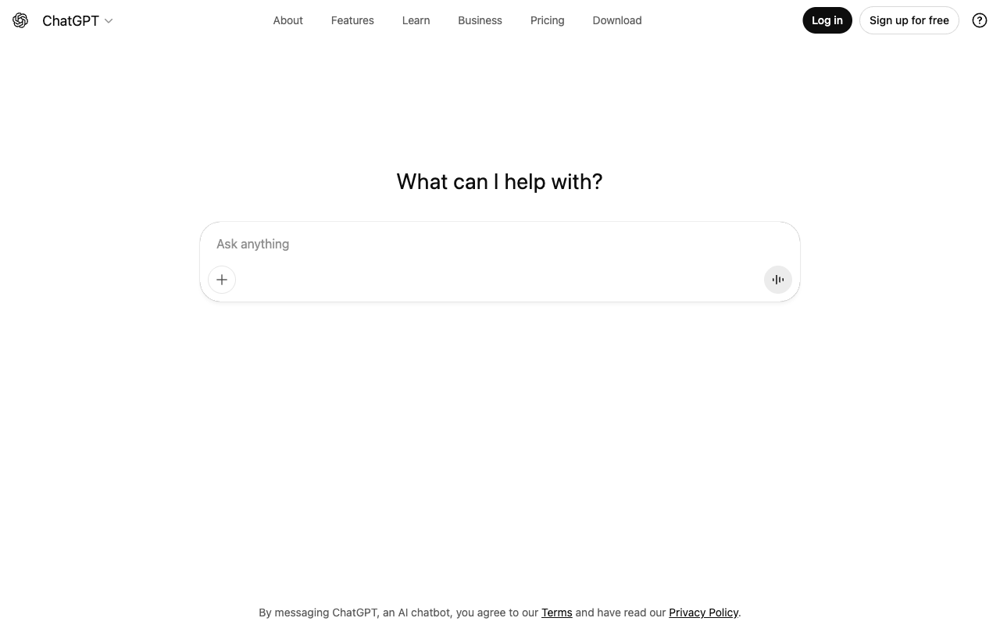
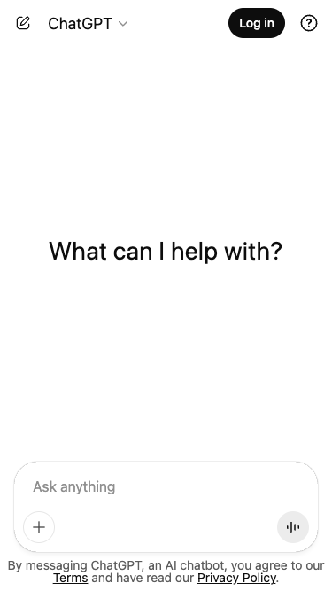

# Getting Started with ChatGPT: A Quick Guide to Writing Effective Prompts

## What is ChatGPT?

ChatGPT is an AI chatbot developed by OpenAI that can understand and generate human-like text. You can use it for writing assistance, coding help, answering questions, brainstorming ideas, and much more.

## Getting Started

Visit [chatgpt.com](https://chatgpt.com) to access the interface. You can start asking questions immediately without creating an account, or sign up for free to save your conversation history.

The interface is simple: type your question or prompt in the "Ask anything" input box and press Enter.

## Writing Effective Prompts

The quality of ChatGPT's responses depends heavily on how you write your prompts. Here are key tips:

### 1. Be Specific and Clear

**Instead of:** "Tell me about Python"

**Try:** "Explain how Python list comprehensions work with 3 practical examples"

### 2. Provide Context

**Instead of:** "Fix this code"

**Try:** "I'm building a Flask web app and getting a 404 error when accessing /api/users. Here's my code: [paste code]. What's wrong?"

### 3. Specify the Format You Want

**Instead of:** "Give me marketing ideas"

**Try:** "Give me 5 social media marketing ideas for a coffee shop, formatted as a numbered list with a brief explanation for each"

### 4. Use Role-Based Prompting

**Try:** "Act as a senior Python developer and review this code for best practices and potential bugs"

## Example Prompts

Here are some effective prompts you can try:

| Use Case | Example Prompt |
|----------|----------------|
| **Learning** | "Explain machine learning to me like I'm a beginner. Include a simple real-world analogy." |
| **Coding** | "Write a Python function that validates email addresses using regex. Include comments and error handling." |
| **Writing** | "Help me write a professional email declining a meeting invitation politely. Keep it under 100 words." |
| **Brainstorming** | "I'm launching a fitness app. Give me 10 unique feature ideas that would differentiate it from competitors." |

## Mobile Access

ChatGPT works great on mobile devices too. The interface adapts to smaller screens while keeping all functionality accessible.

## Quick Tips

- **Iterate on responses** - If the first answer isn't quite right, ask follow-up questions to refine it
- **Ask for alternatives** - Say "Give me 3 different approaches" to explore options
- **Request explanations** - Add "Explain your reasoning" to understand the logic
- **Set constraints** - Specify word limits, tone, or technical level as needed

Start experimenting with your own prompts at [chatgpt.com](https://chatgpt.com)!
